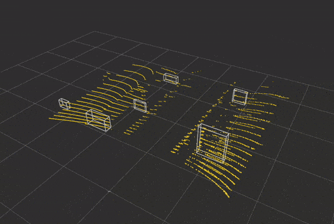

# fast_idler_supports_detection


Fast detection of idler supports in various environments using ROS 2 with PCL and density histograms based on PointCloud2 data.



## Publications

If you use this work in an academic context, please cite the following publication:

> J. Jakubiak, J. Delicat,
> **"Fast detection of idler supports using density histograms in belt conveyors inspection with a mobile robot"**

    @Article{app142310774,
        author = {Jakubiak, Janusz and Delicat, Jakub},
        title = {Fast Detection of Idler Supports Using Density Histograms in Belt Conveyor Inspection with a Mobile Robot},
        journal = {Applied Sciences},
        volume = {14},
        year = {2024},
        number = {23},
        article-number = {10774},
        url = {https://www.mdpi.com/2076-3417/14/23/10774},
        issn = {2076-3417},
        doi = {10.3390/app142310774}
    }

## Dataset
You can download the dataset used in our experiments from the following link:

[Download Dataset](https://k29.pwr.edu.pl/)


## Installation

Clone the repository and its submodules:

```bash
mkdir -p fast_idler_supports_detection/src
cd fast_idler_supports_detection
git clone git@git.kcir.pwr.edu.pl:jdelicat/idlers_detection.git --recursive src
```

Install dependencies using `rosdep`:

```bash
rosdep install --from-paths src --ignore-src -r -y
colcon  build --symlink-install
source install/setup.bash
```

## Running the Algorithm

Run the detection algorithm and save the output to a YAML file:

```bash
ros2 launch fast_idler_supports_detection fast_idler_supports_detection.launch.py bag_file_path:=$(pwd)/path_a_pointcloud_public
```
